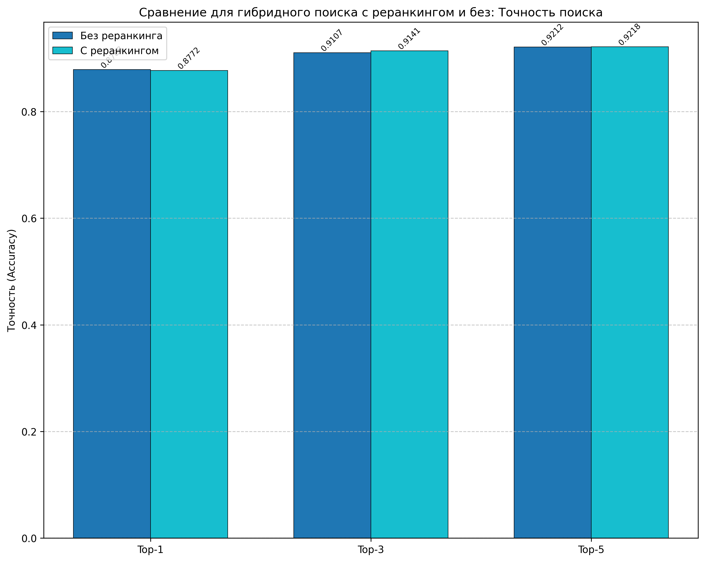

# Бенчмарк RAG системы

Этот инструмент позволяет сравнивать производительность и точность извлечения ответов из БД различных моделей эмбеддингов и алгоритмов поиска для Retrieval-Augmented Generation (RAG) систем.


## Возможности

- Сравнение различных dense моделей (beir.retrieval.models):
``` {
        "all-MiniLM-L6-v2": SentenceBERT("sentence-transformers/all-MiniLM-L6-v2"),  # 384
        "msmarco-MiniLM-L-6-v3": SentenceBERT("sentence-transformers/msmarco-MiniLM-L-6-v3"),  # 384
        "msmarco-roberta-base-ance-firstp": SentenceBERT("sentence-transformers/msmarco-roberta-base-ance-firstp"),  # 768
    }

```
- Сравнение c BM25 `SparseTextEmbedding("Qdrant/bm25")`
- Оценка скорости и точности поиска
- Визуализация результатов в виде графиков
- Поддержка различных алгоритмов поиска (Exact Search, HNSW (Hierarchical Navigable Small World) для dense моделей)
- Поддержка гибрибного поиска в коллекции с разными видами векторов
- Сравнение результатов с реранкингом ( `sentence_transformers CrossEncoder`) и без реранкинга 

## Данные

- Тестирование производилось на датасете с 11000 записями
- Dense эмбеддинги вычисляются перед запуском бенчмарка и сохранены в numpy memmap
- Sparse эмбеддинги сохранены в pkl

## Требования

- Python 3.10+
- Qdrant (запущенный локально или удаленно)
- Необходимые библиотеки (см. `requirements.txt`)

## Установка

```bash
# Установка зависимостей
pip install -r requirements.txt
```

## Использование

### Запуск подсчета эмбеддингов

```
python embeddings_compute.py
```
вычисление производится сразу для всех тестируемых моделей для полного объема данных (процесс занимает примерно 1 час 30 минут)

### Базовый запуск

```bash
python bench.py
```

### Параметры командной строки

```bash
--qdrant-host  # Хост Qdrant сервера
--qdrant-port # Порт Qdrant сервера
--collection-name # Название коллекции в Qdrant
--topk #Количество извлекаемых ответов
--model-names  # Список моделей для сравнения
--batch-size # 'Размер батча для загрузки данных'
--limit #  количество записей для проведения тестирования
```

### Основные параметры

| Параметр            | Описание                                          | Значение по умолчанию                                                          |
|---------------------|---------------------------------------------------|--------------------------------------------------------------------------------|
| `--model-names`     | Список моделей для сравнения                      | `msmarco-roberta-base-ance-firstp all-MiniLM-L6-v2 msmarco-MiniLM-L-6-v3 BM25` |
| `--limit`           | Максимальное количество записей для использования | `11000`                                                                        |
| `--qdrant-host`     | Хост Qdrant сервера                               | `localhost`                                                                    |
| `--qdrant-port`     | Порт Qdrant сервера                               | `6333`                                                                         |
| `--collection-name` | префикс названия коллекции в Qdrant               | `rag`                                                                          |
| `--topk`            | Количество ответов для сравнения                  | `1 3 5`                                                                        |

### Параметры HNSW

| Параметр | Описание | Значение по умолчанию |
|----------|----------|-----------------------|
| `--hnsw-ef` | Параметр ef для HNSW | `128`                 |
| `--hnsw-m` | Параметр m для HNSW (количество соседей) | `32`                  |
| `--ef-construct` | Параметр ef_construct для HNSW | `400`                 |

```
python bench.py --model-names BM25 msmarco-roberta-base-ance-firstp --topk 1 3 --limit 11000
python bench.py --hybrid 1 --limit 11000
```

## Графики для 11_000 записей:

- сравнение точности поиска между разными моделями конвертации текстов в эмбеддинги и методами


- сравнение скорости линейного поиска:


- сравнение точности по трем методам поиска для dense моделей:


- сравнение по скорости поиска по трем методам поиска для dense моделей:

  

- запуск  теста для модели BM25 с различным количеством top_k  


при извлечении 10 ответов, точность самая высокая

- запуск с параметром `--hybrid 1` активируется гибридная модель с реранкингом, в результате получаем сравнение:




- сравнение точности  поиска с разными параметрами 
  - hnsw-ef 128
  - hnsw-ef 256


Отчет о проведении тестирования выглядит так:

```commandline

================================================================================
РЕЗУЛЬТАТЫ ОЦЕНКИ СКОРОСТИ ПОИСКА
================================================================================

Модель: msmarco-MiniLM-L-6-v3
 Алгоритм: Exact Search
 Среднее время: 4.37 мс
 Медианное время: 4.39 мс
 Максимальное время: 28.99 мс
 Минимальное время: 2.43 мс

Модель: msmarco-roberta-base-ance-firstp
 Алгоритм: Exact Search
 Среднее время: 7.54 мс
 Медианное время: 7.46 мс
 Максимальное время: 30.41 мс
 Минимальное время: 3.82 мс

Модель: all-MiniLM-L6-v2
 Алгоритм: Exact Search
 Среднее время: 4.49 мс
 Медианное время: 4.50 мс
 Максимальное время: 28.33 мс
 Минимальное время: 2.59 мс

Модель: BM25
  Алгоритм: Exact Search
  Среднее время: 1.73 мс
  Медианное время: 1.51 мс
  Максимальное время: 21.23 мс
  Минимальное время: 1.00 мс

================================================================================
РЕЗУЛЬТАТЫ ОЦЕНКИ ТОЧНОСТИ ПОИСКА
================================================================================

Модель: msmarco-MiniLM-L-6-v3
  Алгоритм: Exact Search
    Top-1: Точность = 0.7045 (7749/11000)
    Top-3: Точность = 0.7720 (8492/11000)
    Top-5: Точность = 0.7956 (8752/11000)

Модель: msmarco-roberta-base-ance-firstp
  Алгоритм: Exact Search
    Top-1: Точность = 0.7732 (8505/11000)
    Top-3: Точность = 0.8372 (9209/11000)
    Top-5: Точность = 0.8576 (9434/11000)

Модель: all-MiniLM-L6-v2
  Алгоритм: Exact Search
    Top-1: Точность = 0.7570 (8327/11000)
    Top-3: Точность = 0.8245 (9069/11000)
    Top-5: Точность = 0.8465 (9312/11000)

Модель: BM25
  Алгоритм: Exact Search
    Top-1: Точность = 0.8165 (8981/11000)
    Top-3: Точность = 0.8792 (9671/11000)
    Top-5: Точность = 0.8968 (9865/11000)

📊 Создание визуализаций результатов...
✅ Визуализации сохранены в директории ./logs/graphs

================================================================================
✅ БЕНЧМАРК ЗАВЕРШЕН УСПЕШНО
Графики сохранены в директории ./logs/graphs/
================================================================================

```

Коллекции в БД:


### Reranker

Cортировка кандидатов:
модель: `reranker_model = CrossEncoder("cross-encoder/ms-marco-TinyBERT-L-2-v2")`
`reranked_results = sorted(zip(candidates, scores), key=lambda x: x[1], reverse=True)`  

Кандидаты и их соответствующие оценки объединяются в список кортежей с помощью zip. 
Затем этот список сортируется по оценкам (второй элемент каждого кортежа), в порядке убывания (reverse=True). 
Это означает, что кандидаты с более высокими оценками (т.е., более релевантные) будут расположены в начале.


## Примеры использования

Для запуска предустановленного пайплайна обучения набора моделей используется баш-скрипт `example.sh`,
он позволяет запустить и сравнить несколько вариантов работы модели с разной векторизацией и разными параметрами `HNSW`, гибридный поиск с реранкингом и без 


### Сравнение dense моделей

```bash
python bench.py --model-names msmarco-roberta-base-ance-firstp all-MiniLM-L6-v2 msmarco-MiniLM-L-6-v3
```
### Сравнение всех моделей

```bash
python bench.py --model-names msmarco-roberta-base-ance-firstp all-MiniLM-L6-v2 msmarco-MiniLM-L-6-v3
```
### Уменьшение размера выборки

```bash
python bench.py --limit 1000
```

### Настройка параметров HNSW

```bash
python bench.py --hnsw-ef 128 --hnsw-m 32 --ef-construct 400
```

## Результаты

Результаты бенчмарка сохраняются:

- Логи:  `./logs/bench.log` и `./logs/log_timestamp.txt`
- Графики: `./logs/graphs/`

## Структура проекта

- `bench.py` - основной скрипт для запуска бенчмарка
- `read_data_from_csv.py` - функции для чтения данных
- `config.yml` - содержит пути к папкам для сохранения логов и картинок
- `load_config.py` - загружает конфигурацию путей
- `logger_init.py` - инициализация логгирования
- `embeddings_compute.py` - подсчет эмбеддингов
- `hybrid_rerank.py` - создание гибридной коллекции, запуск гибридного поиска и реранкинг
- `dense_model.py` - функции для работы с dense моделями (чтение данных/создание точек загрузки/загрузка в БД/рассчет точности и скорости)
- `sparse_bm25.py` - функции для работы со Sparse моделью (чтение данных/создание точек загрузки/загрузка в БД/рассчет точности и скорости)
- `report_data.py` - печать результатов в лог и на экран
- `visualisation.py` - отрисовка графиков сравнения моделей и видов поиска

## Примечания
- Для корректной работы необходим запущенный сервер Qdrant
- Для больших наборов данных рекомендуется увеличить значение `--batch-size` 
- Для Sparse коллекции в БД отключено построение графа через параметр `hnsw_config=models.HnswConfigDiff(m=0)`
- При работе с гибридной коллекцией `optimizer_config=OptimizersConfigDiff(indexing_threshold=5000)`
- В качестве реранкера используется `sentence_transformers-CrossEncoder`
- В гибридной коллекции присутствуют  
  - LateInteractionTextEmbedding("colbert-ir/colbertv2.0")
  - SparseTextEmbedding("Qdrant/bm25")
  - SentenceBERT("msmarco-distilbert-base-tas-b")

## Выводы:

1. При сравнении dense моделей самая высокая точность у самой "тяжелой" модели (msmarco-roberta-base-ance-firstp), но скорость извления ответов из коллекции, созданной этой моделью ниже
2. Лучшая точность при использовании гибридной модели
3. С реранкингом точность выше
3. Самая высокая скорость извлечения данных при работе с коллекцией BM25
4. Гибридная модель проигрывает по скорости извлечения по сравнению с BM25
