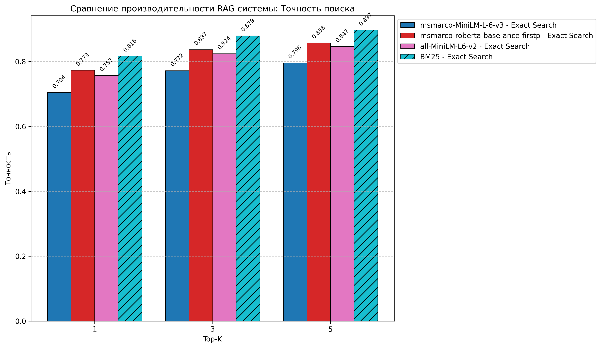
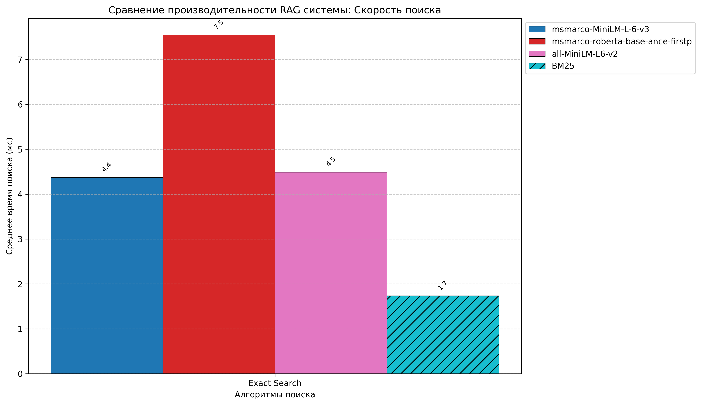
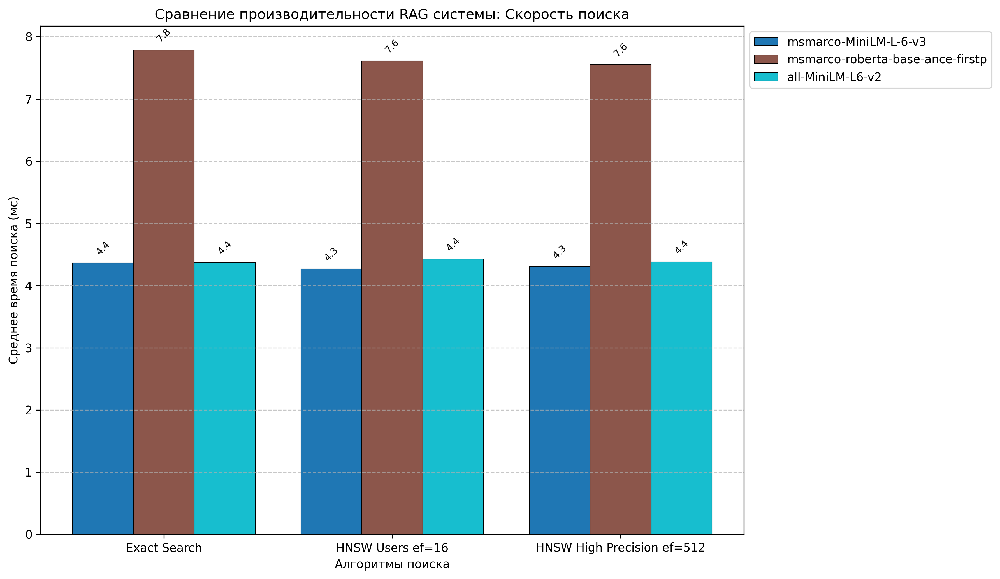
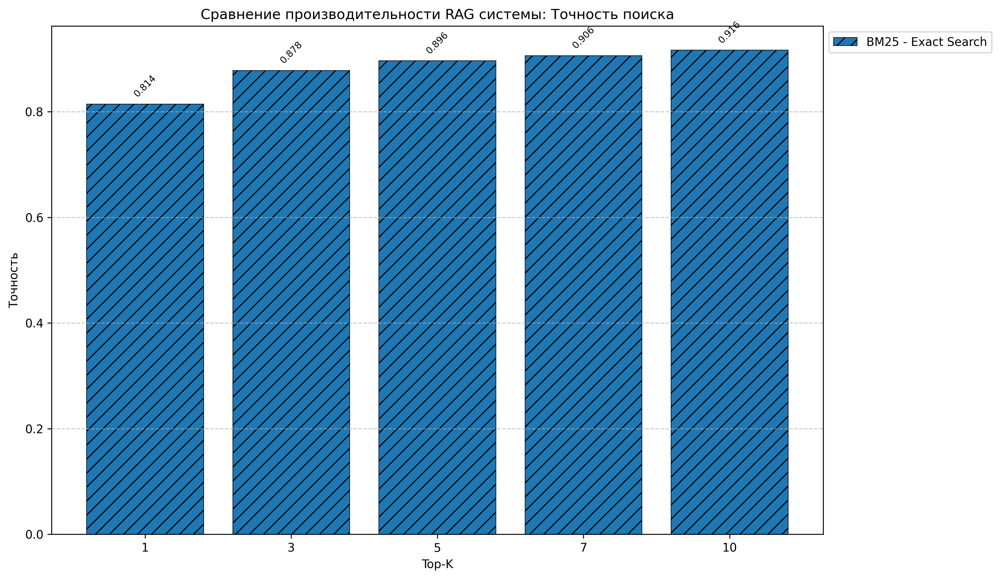
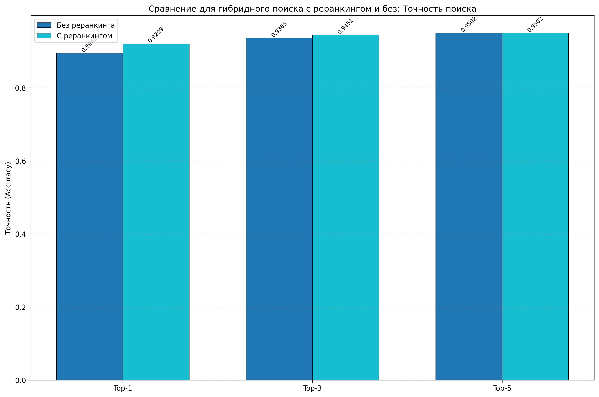
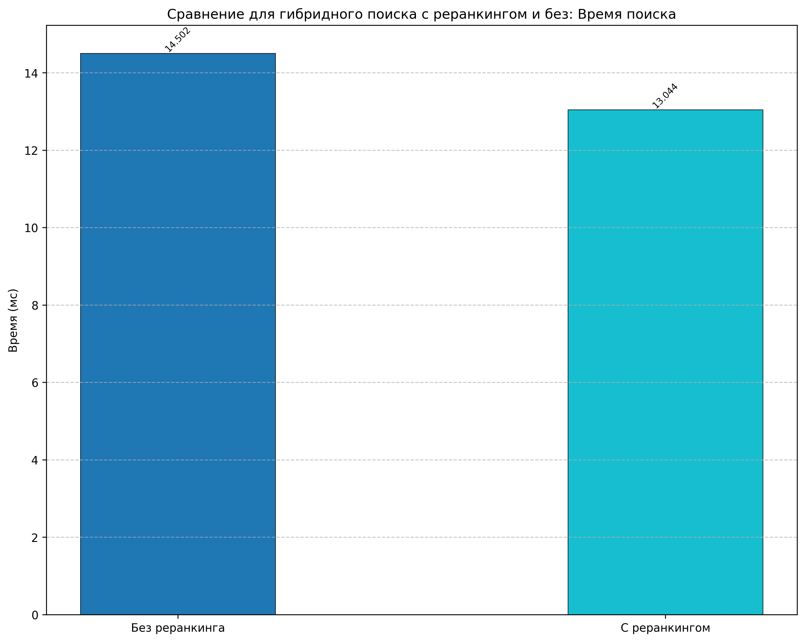
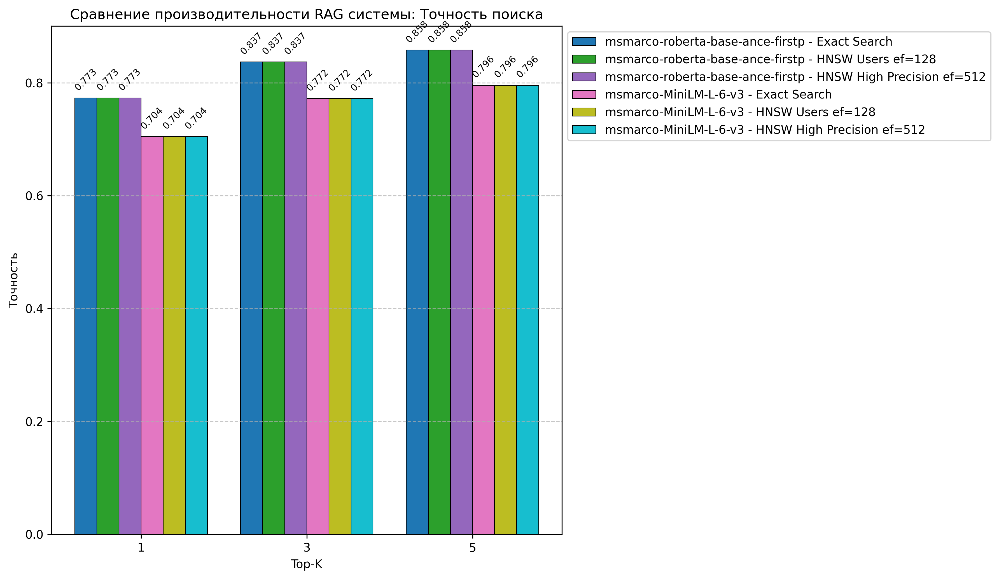
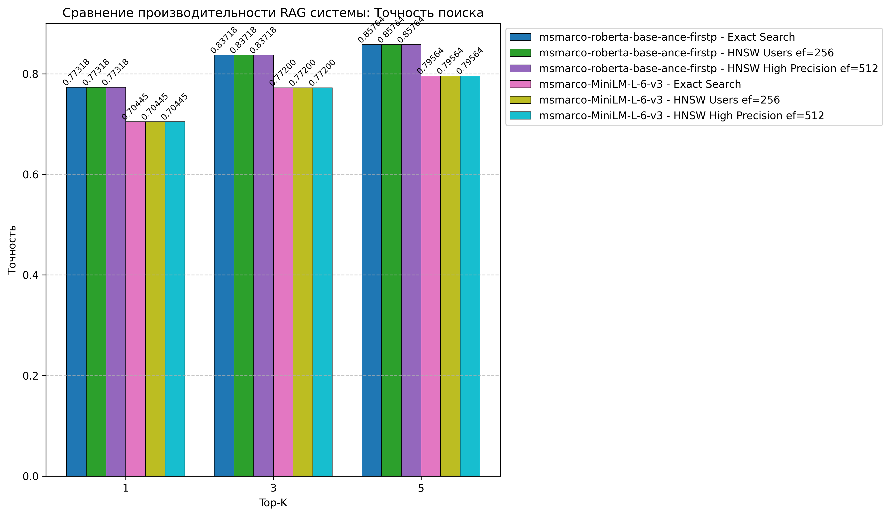
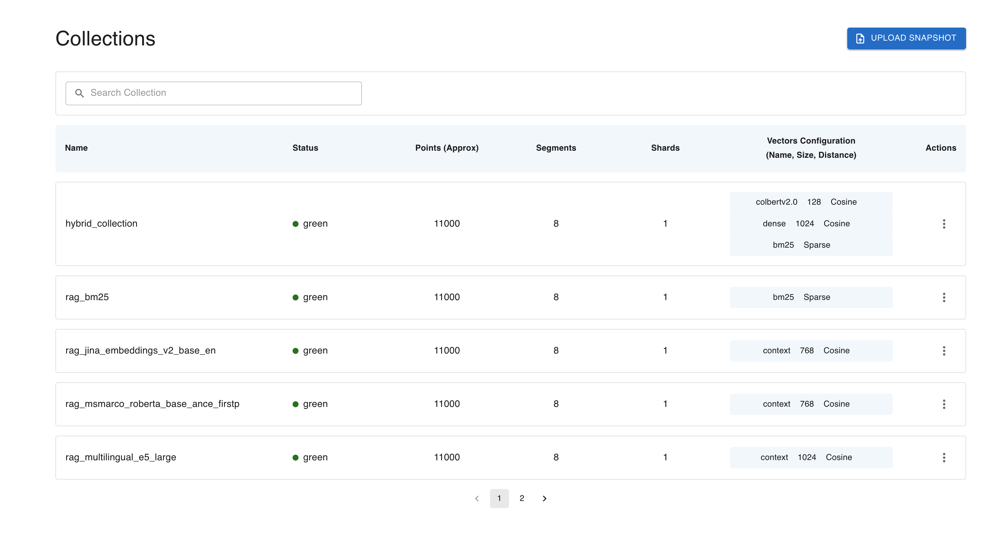

# Бенчмарк RAG системы

Этот инструмент позволяет сравнивать производительность и точность извлечения ответов из БД различных моделей эмбеддингов и алгоритмов поиска для Retrieval-Augmented Generation (RAG) систем.


## Возможности

- Сравнение различных dense моделей (fastembed - TextEmbedding):
``` 
   {
    "jina-embeddings-v2-base-en": TextEmbedding(model_name="jinaai/jina-embeddings-v2-base-en"),  # 768
    "snowflake-arctic-embed-s": TextEmbedding(model_name="snowflake/snowflake-arctic-embed-s"),  # 384
    "mxbai-embed-large-v1": TextEmbedding(model_name="mixedbread-ai/mxbai-embed-large-v1"),      # 1024
    "multilingual-e5-large": TextEmbedding(model_name="intfloat/multilingual-e5-large"),         # 1024 
  }


```
- Сравнение c BM25 `SparseTextEmbedding("Qdrant/bm25")`
- Оценка скорости и точности поиска
- Визуализация результатов в виде графиков
- Поддержка различных алгоритмов поиска (`Exact Search, HNSW (Hierarchical Navigable Small World)` для dense моделей)
- Поддержка гибрибного поиска в коллекции с разными видами векторов (`BM25/LateInteractionTextEmbedding(colbert)/mxbai-embed-large-v1`)
- Сравнение результатов с реранкингом ( `TextCrossEncoder(model_name='BAAI/bge-reranker-base')`) и без реранкинга 

## Данные

- Тестирование производилось на датасете с 11000 записями
- Dense эмбеддинги вычисляются перед запуском бенчмарка и сохранены в numpy memmap
- Sparse эмбеддинги сохранены в pkl

## Требования

- Python 3.10+
- Qdrant (запущенный локально или удаленно)
- Необходимые библиотеки (см. `requirements.txt`)

## Установка

```bash
# Установка зависимостей
pip install -r requirements.txt
```

## Использование

### Запуск подсчета эмбеддингов

```
python embeddings_compute.py
```
вычисление производится сразу для всех тестируемых моделей для полного объема данных (процесс занимает примерно 1 час 30 минут)

### Базовый запуск

```bash
python bench.py
```

### Параметры командной строки

```bash
--qdrant-host  # Хост Qdrant сервера
--qdrant-port # Порт Qdrant сервера
--collection-name # Название коллекции в Qdrant
--topk #Количество извлекаемых ответов
--model-names  # Список моделей для сравнения
--batch-size # 'Размер батча для загрузки данных'
--limit #  количество записей для проведения тестирования
```

### Основные параметры

| Параметр            | Описание                                             | Значение по умолчанию                                  |
|---------------------|------------------------------------------------------|--------------------------------------------------------|
| `--model-names`     | Список моделей для сравнения                         | `jina-embeddings-v2-base-en, snowflake-arctic-embed-s` |
|                     |                                                      | ` mxbai-embed-large-v1, multilingual-e5-large, BM25`   |
| `--limit`           | Максимальное количество записей для использования    | `11000`                                                |
| `--qdrant-host`     | Хост Qdrant сервера                                  | `localhost`                                            |
| `--qdrant-port`     | Порт Qdrant сервера                                  | `6333`                                                 |
| `--collection-name` | префикс названия коллекции в Qdrant                  | `rag`                                                  |
| `--topk`            | Количество ответов для сравнения                     | `1 3 5`                                                |
| `--load`            | Загружать ли данные в БД  Qdrant                     | `1`                                                    |


### Параметры HNSW

| Параметр | Описание | Значение по умолчанию |
|----------|----------|-------------------|
| `--hnsw-ef` | Параметр ef для HNSW | `128`|
| `--hnsw-m` | Параметр m для HNSW (количество соседей) | `32`|
| `--ef-construct` | Параметр ef_construct для HNSW | `400`|

```
python bench.py --model-names BM25 jina-embeddings-v2-base-en, snowflake-arctic-embed-s --topk 1 3 --limit 11000
python bench.py --hybrid 1 --limit 11000
```

## Метрика, используемая для бенчмарка

В нашей системе мы оцениваем, насколько хорошо она находит правильный контекст (правильный ответ) среди списка найденных вариантов. 
Для этого используется метрика Top-k Accuracy — то есть проверяется, входит ли правильный ответ в первые k найденных результатов.

    Для каждого запроса мы получаем список найденных контекстов (результатов), отсортированных по релевантности.
    Мы сравниваем этот список с правильным контекстом — тем, который должен был быть найден.
    Проверяем, находится ли правильный контекст среди первых k мест (например, в топ-1, топ-3, топ-5).
    Если да — считаем это правильным попаданием (correct), иначе — ошибкой.
    Считаем общее количество запросов (total) и количество правильных попаданий (correct) для каждого значения k.

Формула метрики. Для каждого значения k:

    Accuracy@k = (количество правильных попаданий в top-k) / (общее количество запросов)

Что показывает эта метрика

    Насколько часто система возвращает правильный ответ в числе первых k результатов.
    Чем выше значение метрики, тем точнее поиск.
    Использование разных k (например, 1, 3, 5) помогает понять, насколько хорошо система работает при разных ограничениях на количество возвращаемых результатов.


## Графики для 11_000 записей:

- сравнение точности поиска между разными моделями конвертации текстов в эмбеддинги и методами



- сравнение скорости линейного поиска:



- сравнение точности по трем методам поиска для dense моделей:


- сравнение по скорости поиска по трем методам поиска для dense моделей:

  

- запуск  теста для модели BM25 с различным количеством top_k  



при извлечении 10 ответов, точность самая высокая

- запуск с параметром `--hybrid 1` активируется гибридная модель с реранкингом, в результате получаем сравнение:





- сравнение точности  поиска с разными параметрами 
  - hnsw-ef 128
  - hnsw-ef 256





Отчет о проведении тестирования выглядит так:

```commandline

================================================================================
РЕЗУЛЬТАТЫ ОЦЕНКИ СКОРОСТИ ПОИСКА
================================================================================

Модель: mxbai-embed-large-v1
 Алгоритм: Exact Search
 Среднее время: 9.66 мс
 Медианное время: 9.57 мс
 Максимальное время: 85.46 мс
 Минимальное время: 4.55 мс

Модель: snowflake-arctic-embed-s
 Алгоритм: Exact Search
 Среднее время: 4.51 мс
 Медианное время: 4.29 мс
 Максимальное время: 31.28 мс
 Минимальное время: 3.11 мс

Модель: jina-embeddings-v2-base-en
 Алгоритм: Exact Search
 Среднее время: 8.33 мс
 Медианное время: 8.27 мс
 Максимальное время: 138.45 мс
 Минимальное время: 4.02 мс

Модель: multilingual-e5-large
 Алгоритм: Exact Search
 Среднее время: 9.47 мс
 Медианное время: 9.43 мс
 Максимальное время: 55.16 мс
 Минимальное время: 4.56 мс

Модель: BM25
  Алгоритм: Exact Search
  Среднее время: 1.80 мс
  Медианное время: 1.61 мс
  Максимальное время: 36.76 мс
  Минимальное время: 1.03 мс

================================================================================
РЕЗУЛЬТАТЫ ОЦЕНКИ ТОЧНОСТИ ПОИСКА
================================================================================

Модель: mxbai-embed-large-v1
  Алгоритм: Exact Search
    Top-1: Точность = 0.8562 (9418/11000)
    Top-3: Точность = 0.9033 (9936/11000)
    Top-5: Точность = 0.9185 (10103/11000)

Модель: snowflake-arctic-embed-s
  Алгоритм: Exact Search
    Top-1: Точность = 0.5949 (6544/11000)
    Top-3: Точность = 0.6792 (7471/11000)
    Top-5: Точность = 0.7117 (7829/11000)

Модель: jina-embeddings-v2-base-en
  Алгоритм: Exact Search
    Top-1: Точность = 0.8059 (8865/11000)
    Top-3: Точность = 0.8651 (9516/11000)
    Top-5: Точность = 0.8833 (9716/11000)

Модель: multilingual-e5-large
  Алгоритм: Exact Search
    Top-1: Точность = 0.8677 (9545/11000)
    Top-3: Точность = 0.9118 (10030/11000)
    Top-5: Точность = 0.9252 (10177/11000)

Модель: BM25
  Алгоритм: Exact Search
    Top-1: Точность = 0.8163 (8979/11000)
    Top-3: Точность = 0.8779 (9657/11000)
    Top-5: Точность = 0.8974 (9871/11000)

📊 Создание визуализаций результатов...
✅ Визуализации сохранены в директории ./logs/graphs

================================================================================
✅ БЕНЧМАРК ЗАВЕРШЕН УСПЕШНО
Графики сохранены в директории ./logs/graphs/
================================================================================

```

Коллекции в БД:


### Reranker

Cортировка кандидатов:
модель: `reranker_model = CrossEncoder("cross-encoder/ms-marco-TinyBERT-L-2-v2")`  
`ranking = [(i, score) for i, score in enumerate(new_scores)]
ranking.sort(key=lambda x: x[1], reverse=True)
reranked = [(texts[i], score) for i, score in ranking]`


Кандидаты и их соответствующие оценки объединяются в список кортежей с помощью zip. 
Затем этот список сортируется по оценкам (второй элемент каждого кортежа), в порядке убывания (reverse=True). 
Это означает, что кандидаты с более высокими оценками (т.е., более релевантные) будут расположены в начале.


## Примеры использования

Для запуска предустановленного пайплайна обучения набора моделей используется баш-скрипт `example.sh`,
он позволяет запустить и сравнить несколько вариантов работы модели с разной векторизацией и разными параметрами `HNSW`, гибридный поиск с реранкингом и без 


### Сравнение dense моделей

```bash
python bench.py --model-names msmarco-roberta-base-ance-firstp all-MiniLM-L6-v2 msmarco-MiniLM-L-6-v3
```
### Сравнение всех моделей

```bash
python bench.py --model-names msmarco-roberta-base-ance-firstp all-MiniLM-L6-v2 msmarco-MiniLM-L-6-v3 BM25
```
### Уменьшение размера выборки

```bash
python bench.py --limit 1000
```

### Настройка параметров HNSW

```bash
python bench.py --hnsw-ef 128 --hnsw-m 32 --ef-construct 400
```

## Результаты

Результаты бенчмарка сохраняются:

- Логи:  `./logs/bench.log` и `./logs/log_timestamp.txt`
- Графики: `./logs/graphs/`

## Структура проекта

- `bench.py` - основной скрипт для запуска бенчмарка
- `read_data_from_csv.py` - функции для чтения данных
- `config.yml` - содержит пути к папкам для сохранения логов и картинок
- `load_config.py` - загружает конфигурацию путей
- `logger_init.py` - инициализация логгирования
- `models_init.py` - содержит словари со списками моделей и размерами эмбеддингов
- `embeddings_compute.py` - подсчет эмбеддингов
- `hybrid_rerank.py` - создание гибридной коллекции, запуск гибридного поиска и реранкинг
- `dense_model.py` - функции для работы с dense моделями (чтение данных/создание точек загрузки/загрузка в БД/рассчет точности и скорости)
- `sparse_bm25.py` - функции для работы со Sparse моделью (чтение данных/создание точек загрузки/загрузка в БД/рассчет точности и скорости)
- `report_data.py` - печать результатов в лог и на экран
- `visualisation.py` - отрисовка графиков сравнения моделей и видов поиска

## Примечания
- Для корректной работы необходим запущенный сервер Qdrant
- Для больших наборов данных рекомендуется увеличить значение `--batch-size` 
- Для Sparse коллекции в БД отключено построение графа через параметр `hnsw_config=models.HnswConfigDiff(m=0)`
- Для LateInteractionTextEmbedding в БД отключено построение графа через параметр `hnsw_config=models.HnswConfigDiff(m=0)`
- При работе с гибридной коллекцией `optimizer_config=OptimizersConfigDiff(indexing_threshold=5000)`
- В качестве реранкера используется `cross-encoder/ms-marco-TinyBERT-L-2-v2`
- В гибридной коллекции присутствуют  
  - LateInteractionTextEmbedding("colbert-ir/colbertv2.0")
  - SparseTextEmbedding("Qdrant/bm25")
  - SentenceBERT("msmarco-distilbert-base-tas-b")

## Выводы:

1. При сравнении dense моделей самая высокая точность у самой "тяжелой" модели (msmarco-roberta-base-ance-firstp), но скорость извления ответов из коллекции, созданной этой моделью ниже
2. Лучшая точность при использовании гибридной модели
3. С реранкингом точность выше
3. Самая высокая скорость извлечения данных при работе с коллекцией BM25
4. Гибридная модель проигрывает по скорости извлечения по сравнению с BM25
